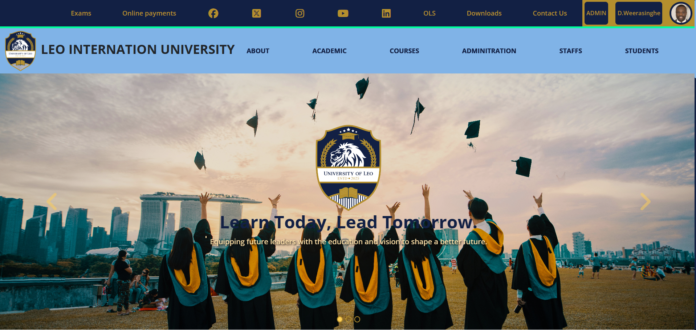
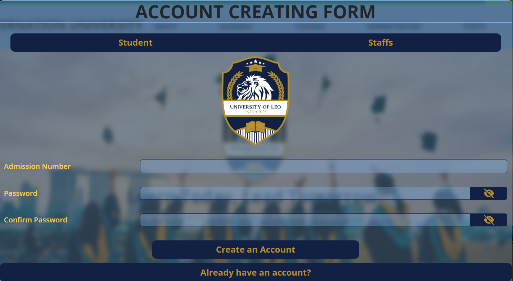
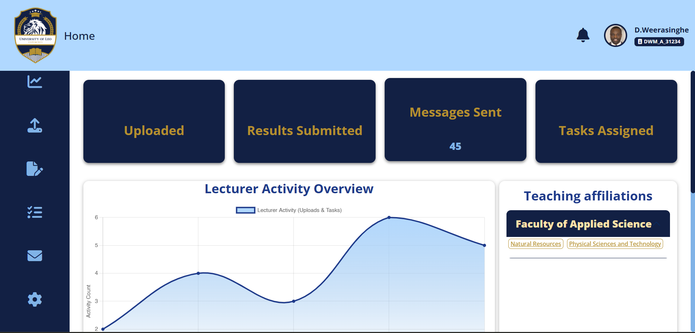
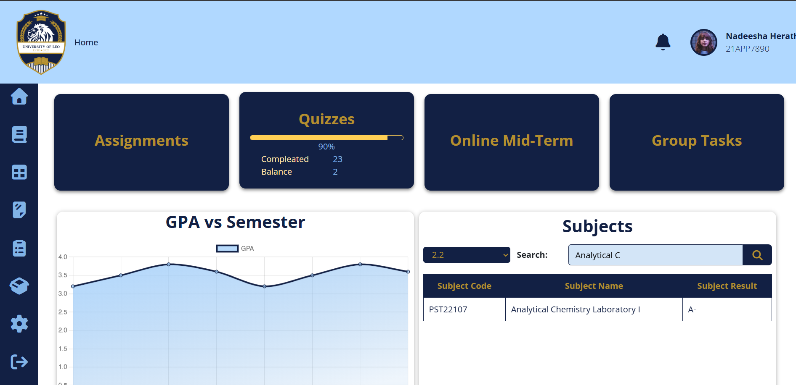
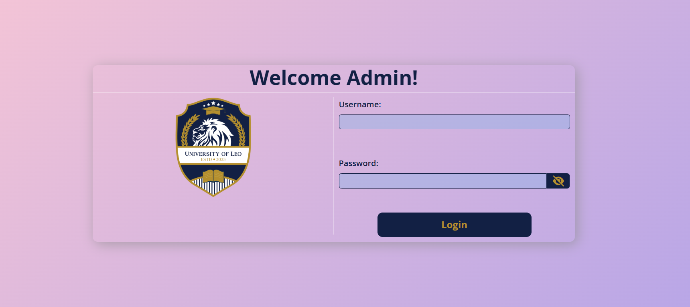
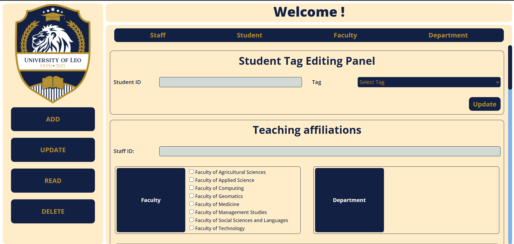
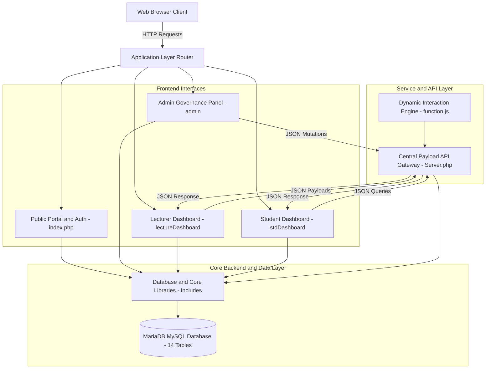
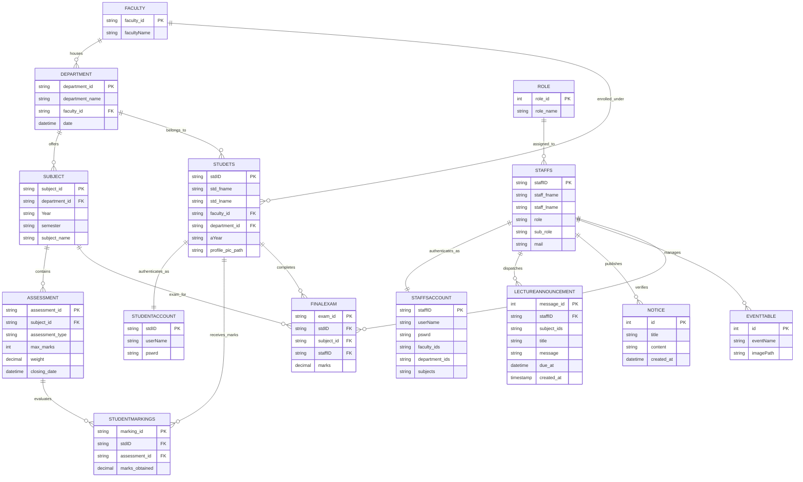

# 🎓 Leo International University Management System (LMS / UMS)

[](https://www.php.net/)
[](https://www.mysql.com/)
[](https://developer.mozilla.org/en-US/docs/Web/JavaScript)
[](https://getbootstrap.com/)
[](https://www.chartjs.org/)
[](https://github.com/)

An enterprise-grade, multi-tenant University Management & Learning Platform engineered to streamline higher education workflows across academic faculties, lecture departments, administrative governance, and student communities.

---

## 📌 Table of Contents

- [🎓 Leo International University Management System (LMS / UMS)](#-leo-international-university-management-system-lms--ums)
  - [📌 Table of Contents](#-table-of-contents)
  - [🏛 Executive Summary](#-executive-summary)
  - [📸 System UI Showcase](#-system-ui-showcase)
  - [🏗 System Architecture](#-system-architecture)
  - [🗄 Database Schema \& ER Model](#-database-schema--er-model)
  - [📂 Directory Structure](#-directory-structure)
  - [🚀 Core Functional Modules](#-core-functional-modules)
    - [1. Public University Portal](#1-public-university-portal)
    - [2. Administrative Governance Center](#2-administrative-governance-center)
    - [3. Lecturer Academic Management Dashboard](#3-lecturer-academic-management-dashboard)
    - [4. Student Academic \& Learning Dashboard](#4-student-academic--learning-dashboard)
    - [5. Central Asynchronous API \& Payload Engine (`Server.php`)](#5-central-asynchronous-api--payload-engine-serverphp)
  - [📈 Development Logs \& Milestone Changelog](#-development-logs--milestone-changelog)
  - [📊 Component Development Status](#-component-development-status)
  - [🔮 Future Roadmap](#-future-roadmap)
  - [💻 Installation \& Local Setup](#-installation--local-setup)
    - [Prerequisites](#prerequisites)
    - [Step-by-Step Installation](#step-by-step-installation)
  - [🛡 Security \& Technical Highlights](#-security--technical-highlights)
  - [👨‍💻 Developer \& Project Inquiries](#-developer--project-inquiries)

---

## 🏛 Executive Summary

The **Leo International University System** is built to bridge the operational gap between university administration, academic faculties, educators, and undergraduates. Rather than relying on disparate spreadsheets and fragmented tools, this platform unifies:

- **Role-Based Access Control (RBAC):** Distinct dashboards and security tiers for Administrators, Deans, Academic Lecturers, Non-Academic Staff, and Undergraduates.
- **Payload-Driven Asynchronous APIs:** REST-style JSON payload dispatchers (`00001` through `00004`) consumed by native JavaScript `fetch()` calls for live, non-blocking UI mutations.
- **Institutional Branding System:** Tailored university design palette (Royal Navy `#122044`, Institutional Gold `#b48f2e`, Soft Sky `#80b3e7`) built directly into a modular custom CSS system.
- **Dynamic Academic Hierarchy:** Multi-tier relational binding between faculties, sub-departments, curriculum modules, continuous assessment markings, targeted broadcasts, and staff teaching affiliations.

---

## 📸 System UI Showcase

<div align="center">

|                                                                              🏛️ Public Institutional Portal & Landing Page                                                                               |                                                                                  🔐 Role-Based Authentication & ID Generator                                                                                  |
| :------------------------------------------------------------------------------------------------------------------------------------------------------------------------------------------------------: | :-----------------------------------------------------------------------------------------------------------------------------------------------------------------------------------------------------------: |
|     <br><sub><b>Figure 1.1:</b> Public landing portal featuring dynamic event carousel, campus highlights, and faculty catalog.</sub>     |  <br><sub><b>Figure 1.2:</b> Unified authentication modal with role-based sign-in and dynamic student/staff identity card preview.</sub>   |
|                                                                                   **📊 Lecturer Academic Workstation**                                                                                   |                                                                                   **🎓 Student Learning & Progress Portal**                                                                                   |
| <br><sub><b>Figure 1.3:</b> Lecturer workstation featuring Chart.js activity analytics, modular sidebar, and affiliations accordion.</sub> |        <br><sub><b>Figure 1.4:</b> Student portal tracking continuous assessment progress, quizzes, tasks, and asynchronous search.</sub>        |
|                                                                                   **🛡️ Administrative Security Gate**                                                                                    |                                                                                **⚙️ Central Administrative Governance Panel**                                                                                 |
|               <br><sub><b>Figure 1.5:</b> Administrative authentication gateway with encrypted credential verification.</sub>               | <br><sub><b>Figure 1.6:</b> Admin management panel providing full CRUD operations across students, staff, faculties, and departments.</sub> |

</div>

---

## 🏗 System Architecture

The application adopts a modular, service-assisted MVC/SPA hybrid design. Centralized database abstraction and reusable helper libraries feed role-specific sub-systems while an asynchronous API layer handles live filtering and dynamic updates.



---

## 🗄 Database Schema & ER Model

The relational architecture is governed by **14 normalized relational tables** featuring indexed primary keys, foreign key constraints, and cascade safety:



---

## 📂 Directory Structure

```text
c:/xampp/htdocs/Leo Univercity.com/
│
├── admin/                           # Administrative Control Center
│   ├── index.php                    # Admin credential authorization gate
│   ├── AdminPanal.php               # Main admin navigation panel
│   ├── landningPage.php             # Administrative landing overview & system telemetry
│   ├── add.php                      # Entity provisioning (Students, Staff, Faculties, Modules)
│   ├── read.php                     # Live record inspector & search directories
│   ├── update.php                   # Record modification & hierarchy management
│   └── delete.php                   # Record termination & cascade safety handler
│
├── Includes/                        # Global Core Backend Subroutines
│   ├── connection.php               # Persistent MySQLi database connection instance
│   └── function.php                 # Shared business logic, ID generators, view helpers
│
├── JavaScript/                      # Dynamic Client-side Interaction Layer
│   └── function.js                  # Asynchronous Fetch handlers, DOM transformers, toasts
│
├── lectureDashboard/                # Lecturer Academic Workstation
│   ├── home.php                     # Modular dashboard shell with sidebar, header & badges
│   ├── dashboard.php                # Summary metrics, affiliations accordion, notices
│   ├── setting.php                  # Profile, credentials, and one-time affiliation locking
│   ├── stdManagement.php            # Department-wise student progress & cohort manager
│   ├── FacDep.php                   # Faculty-department affiliation binding utilities
│   └── test.php                     # Sandbox environment for experimental modules
│
├── stdDashboard/                    # Student Learning & Performance Portal
│   ├── home.php                     # Academic progress meters, assignments, quizzes
│   ├── student.php                  # Student profile overview, transcripts, module listings
│   ├── userInterface.php            # Interactive curriculum browser with search
│   └── getData.php                  # Asynchronous JSON endpoint for student subjects
│
├── Dynamic images/                  # User Uploads & Generated Assets
│   ├── events/                      # Dynamic event banners
│   ├── students/                    # Student profile photos
│   └── staffs/                      # Staff & lecturer identity imagery
│
├── static images/                   # University Brand Assets & Vector Icons
│   ├── CarouselImages/              # High-resolution campus hero banners
│   ├── uniLife/                     # Campus culture, alumni, and athletic imagery
│   └── LOGO1.png                    # Primary university crest & emblem
│
├── index.php                        # Public institutional homepage & unified auth portal
├── login.php                        # Authentication handler for multi-role sessions
├── Server.php                       # Central asynchronous API & JSON payload controller
├── alertBoxcontainer.php            # Animated floating notification component
├── alert.json                       # Alert configuration storage
├── adminCredential.env              # Encrypted administrator master credentials
├── leouni_db.sql                    # Complete MariaDB database schema & seeds (14 tables)
├── project_log.txt                  # Historical engineering log & milestones
├── style.css                        # Comprehensive custom design system & themes
└── README.md                        # Project documentation & recruitment brief
```

---

## 🚀 Core Functional Modules

### 1. Public University Portal

- **Interactive Campus Showcase:** Full-width dynamic carousel highlighting academic milestones, alumni achievements, and campus facilities.
- **Dynamic Identity Cards:** Live auto-rendering preview cards for students and faculty featuring dynamic identification codes and algorithmic placeholder avatars derived from National Identity Card (NIC) data.
- **Unified Authentication:** Multi-tier gateway verifying role tokens (Student, Lecturer, Dean, Admin) with password verification and session continuity.

### 2. Administrative Governance Center

- **Full Spectrum CRUD:** Provisioning and lifecycle management of students, faculty members, academic departments, and semester modules.
- **Hierarchical Cascading Selectors:** Dynamic dependent dropdowns (e.g., changing Faculty instantly repopulates relevant Departments via `departmentSelectUpdator()`).
- **Affiliation Management:** Assigning multi-faculty, multi-department, and module codes to academic accounts.
- **Non-Destructive Alert Engine:** Custom animated toast feedback (`autoToast()`) indicating transaction states.

### 3. Lecturer Academic Management Dashboard

- **Activity Overview Visualizer:** Dynamic analytics dashboard rendering engagement trends via Chart.js with responsive gradients.
- **Modular Single-Page Navigation:** Query-driven sub-view loader (`?dashboard`, `?setting`) preserving parent context, badges, and header status.
- **One-Time Affiliation Security Gate:**
  - Lecturers can configure initial Faculty, Department, and Subject affiliations once.
  - After confirmation, affiliations lock automatically; subsequent modifications require submitting an administrative change request through the integrated channel.
- **Targeted Broadcast Announcements:** Multi-module notification dispatcher saving targeted cohort alerts directly into the `lectureannouncement` table via asynchronous payload API.
- **Department-Wise Cohort Management (`stdManagement.php`):** Granular tracking of departmental student bodies, performance indicators, and submission records.

### 4. Student Academic & Learning Dashboard

- **Progress Trackers:** Radial/bar indicators tracking completion ratios across Assignments, Quizzes, Midterms, and Group Deliverables.
- **Asynchronous Subject Directory:** Live searchable, year-filtered curriculum query engine running on `fetch()` and `getData.php` without full-page reloads.
- **Academic Transcript & GPA Tools:** Automated calculation foundations linking course weights with raw scores.

### 5. Central Asynchronous API & Payload Engine (`Server.php`)

The application features a structured JSON payload routing protocol in `Server.php`:

|        Payload ID / Query        | Target Domain            | Action & Database Transaction                                                                                                                   |
| :------------------------------: | :----------------------- | :---------------------------------------------------------------------------------------------------------------------------------------------- |
|           **`00001`**            | Lecturer Announcements   | Persists targeted class announcement into `lectureannouncement` with `staffID`, pipe-separated `subject_ids`, `title`, `message`, and `due_at`. |
|           **`00002`**            | Staff Profile Management | Asynchronously updates lecturer `userName` in `staffsaccount`.                                                                                  |
|           **`00003`**            | Security & Credentials   | Verifies current credentials with `password_verify()`, hashes new credentials with `PASSWORD_BCRYPT`, and commits to `staffsaccount`.           |
|           **`00004`**            | Faculty Directory Query  | Performs live wildcard search matching `setting_faculty_ids` in `faculty`.                                                                      |
|   `?YEAR_AND_SEM` & `?SEARCH`    | Student Exam Results     | Returns JSON-encoded examination grade matrices.                                                                                                |
| `?fac`, `?dep`, `?sub`, `?stfId` | Admin Affiliations       | Commits pipe-delimited faculty, department, and subject affiliations to `staffsaccount`.                                                        |

---

## 📈 Development Logs & Milestone Changelog

Derived from chronological engineering iterations documented in `project_log.txt`:

| Milestone Date        | Iteration Focus                    | Key Deliverables & Technical Achievements                                                                                                                                                                                                                                                                                                                                                 |
| :-------------------- | :--------------------------------- | :---------------------------------------------------------------------------------------------------------------------------------------------------------------------------------------------------------------------------------------------------------------------------------------------------------------------------------------------------------------------------------------- |
| **Oct 26, 2025**      | _Architecture Scaffolding_         | • Implemented dual-dashboard strategy for Students and Lecturers.<br>• Designed student GPA calculator foundations and grading distribution plots.<br>• Created lecturer material upload workflows and task assignment matrix (group-wise, department-wise, gender-wise).                                                                                                                 |
| **Oct 30, 2025**      | _Student UI & Interactivity_       | • Finalized Student Dashboard UI layout.<br>• Implemented asynchronous dynamic module tables via JavaScript Fetch API.<br>• Activated responsive dashboard sidebar navigation links.                                                                                                                                                                                                      |
| **Jan 13, 2026**      | _Asynchronous Grade Engine_        | • Delivered asynchronous student result table (`examResultTable`).<br>• Designed continuous assessment schema integration (`studentmarkings` table).<br>• Established JSON REST API protocols via `Server.php`.                                                                                                                                                                           |
| **Jan 29, 2026**      | _Affiliation Infrastructure_       | • Built administrative faculty-to-department lecturer allocation engine.<br>• Enhanced lecturer access permissions to cross-reference continuous assessment and final exam score sheets.                                                                                                                                                                                                  |
| **Mar 20, 2026**      | _Affiliation UI & Data Integrity_  | • Implemented empty-state guards and descriptive error alerts for unassigned staff IDs.<br>• Added subject binding fields to the `staffsaccount` database table.<br>• Upgraded admin panel to support multi-subject pipe-delimited allocations (`faculty_ids`, `department_ids`, `subjects`).                                                                                             |
| **Sep 2026 (Recent)** | _Broadcast & Payload Architecture_ | • Engineered table `lectureannouncement` with relational foreign keys to `staffs`.<br>• Implemented central payload API (`payloadid` 00001–00004) in `Server.php` for announcements, profile updates, and bcrypt password mutations.<br>• Built `lectureDashboard/setting.php` featuring one-time affiliation locking, admin approval request pipeline, and dynamic module badge headers. |

---

## 📊 Component Development Status

| Component / Subsystem             | Primary Files                                   |      Status      | Highlights                                                                            |
| :-------------------------------- | :---------------------------------------------- | :--------------: | :------------------------------------------------------------------------------------ |
| **Public Portal & Auth**          | `index.php`, `login.php`                        |  `Completed` ✅  | Dynamic carousel, ID preview generator, session management.                           |
| **Database Architecture**         | `leouni_db.sql`, `connection.php`               |  `Completed` ✅  | 14 normalized tables, foreign keys, cascade rules, clean seeds.                       |
| **Admin CRUD Suite**              | `admin/add.php`, `update.php`, etc.             |  `Completed` ✅  | Role-based provisioning, cascading selectors, modal feedback.                         |
| **Admin Analytics**               | `admin/landningPage.php`                        |  `Completed` ✅  | System counters, enrollment summaries, database status.                               |
| **Lecturer Activity View**        | `lectureDashboard/home.php`                     |  `Completed` ✅  | Chart.js visualizer, responsive grid layout, compact staff ID badges.                 |
| **Lecturer Affiliations**         | `lectureDashboard/dashboard.php`                |  `Completed` ✅  | Accordion-based hierarchical faculty/department explorer.                             |
| **Broadcast Announcements**       | `Server.php`, `lectureannouncement`             |  `Completed` ✅  | Live dispatch into `lectureannouncement` linked to multiple subjects.                 |
| **Account & Security Settings**   | `lectureDashboard/setting.php`, `Server.php`    |  `Completed` ✅  | One-time affiliation lock, admin change request, password update via payload `00003`. |
| **Cohort Student Manager**        | `lectureDashboard/stdManagement.php`            | `In Progress` 🟡 | Department-level student performance explorer and submission viewer.                  |
| **Student Asynchronous Search**   | `stdDashboard/userInterface.php`, `getData.php` |  `Completed` ✅  | Real-time year and keyword module filtering via Fetch API.                            |
| **Assessment & Marking Pipeline** | `Server.php`, `function.php`                    | `In Progress` 🟡 | Linking raw scores from `studentmarkings` and `finalexam`.                            |
| **Interactive UI Animations**     | `style.css`, `function.js`                      |   `Planned` 🚀   | Transitioning micro-interactions to the GSAP.js animation library.                    |

---

## 🔮 Future Roadmap

- [ ] **Continuous Assessment Submissions:** Direct PDF/ZIP coursework submission engine linking student uploads directly to lecturer marking queues in `studentmarkings`.
- [ ] **Exam Board Final Grade Portal:** Direct grading verification interface for Faculty Deans to authorize published scores from `finalexam`.
- [ ] **Real-Time Notification Websockets:** Transitioning announcement dispatches from polling to live socket alerts for enrolled students.
- [ ] **Interactive Canvas & GSAP Motion:** Advanced animation sequencing for landing page transitions and dashboard telemetry using GSAP.js.
- [ ] **Automated GPA Generator:** Algorithmic calculation of GPA and academic standing based on earned credits and standard semester grade points.

---

## 💻 Installation & Local Setup

### Prerequisites

- **Local Web Server:** [XAMPP](https://www.apachefriends.org/) (Recommended), WAMP, or LAMP.
- **PHP Version:** 8.0 or higher (configured with `mysqli` extension enabled).
- **Database Server:** MariaDB / MySQL 10.4+.
- **Web Browser:** Modern browser (Chrome, Edge, Firefox, Safari) with JavaScript enabled.

### Step-by-Step Installation

1. **Clone or Copy Repository:**
   Place the project directory inside your local web root:

   ```bash
   # For XAMPP on Windows:
   c:\xampp\htdocs\Leo Univercity.com
   ```

2. **Start Local Services:**
   Launch the XAMPP Control Panel and start **Apache** and **MySQL**.

3. **Import the Database:**
   - Open phpMyAdmin in your browser: `http://localhost/phpmyadmin/`.
   - Create a new database named `leouni_db` with collation `utf8mb4_general_ci`.
   - Select `leouni_db`, navigate to the **Import** tab, choose the file `leouni_db.sql` located at the root of the project, and click **Import**.

4. **Verify Database Connection:**
   Confirm configuration parameters in `Includes/connection.php`:

   ```php
   $con = mysqli_connect("localhost", "root", "", "leouni_db");
   ```

5. **Launch the Application:**
   Open your browser and navigate to:

   ```text
   http://localhost/Leo%20Univercity.com/
   ```

6. **Administrative Access:**
   - Admin Panel URL: `http://localhost/Leo%20Univercity.com/admin/`
   - Admin credentials are verified against `adminCredential.env`.

---

## 🛡 Security & Technical Highlights

- **SQL Injection Prevention:** Input sanitization, parameter escaping, and centralized SQL execution via helper wrappers.
- **Session Integrity:** Strict session parameter checks (`$_SESSION['STFID']`, `$_SESSION['STDID']`) enforcing route protection on internal dashboard pages.
- **Bcrypt Password Hashing:** User passwords hashed using PHP's native `password_hash($password, PASSWORD_BCRYPT)` and authenticated with `password_verify()`.
- **Zero Framework Bloat:** High UI responsiveness achieved without heavy front-end build pipelines, leveraging native DOM methods, modern CSS Grid/Flexbox, and vanilla Fetch API.
- **Graceful Error Handling:** PHP 8+ null-coalescing operations and conditional fallback arrays preventing fatal runtime TypeErrors on incomplete records.

---

## 👨‍💻 Developer & Project Inquiries

- **Lead Engineer:** Fahadh Muhammadh
- **Project Repository:** [FahadhCodes/leoInternationalUniversitySystem](https://github.com/FahadhCodes/leoInternationalUniversitySystem)
- **Academic Institution:** Leo International University
  _Crafted with precision for academic excellence and modern institutional governance._
